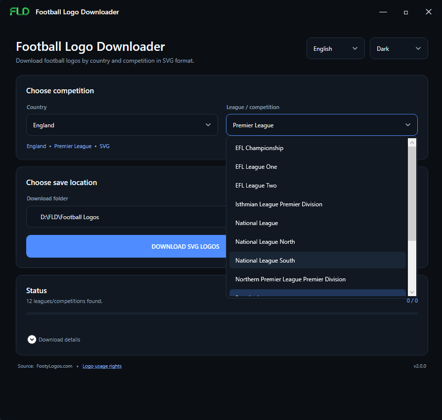
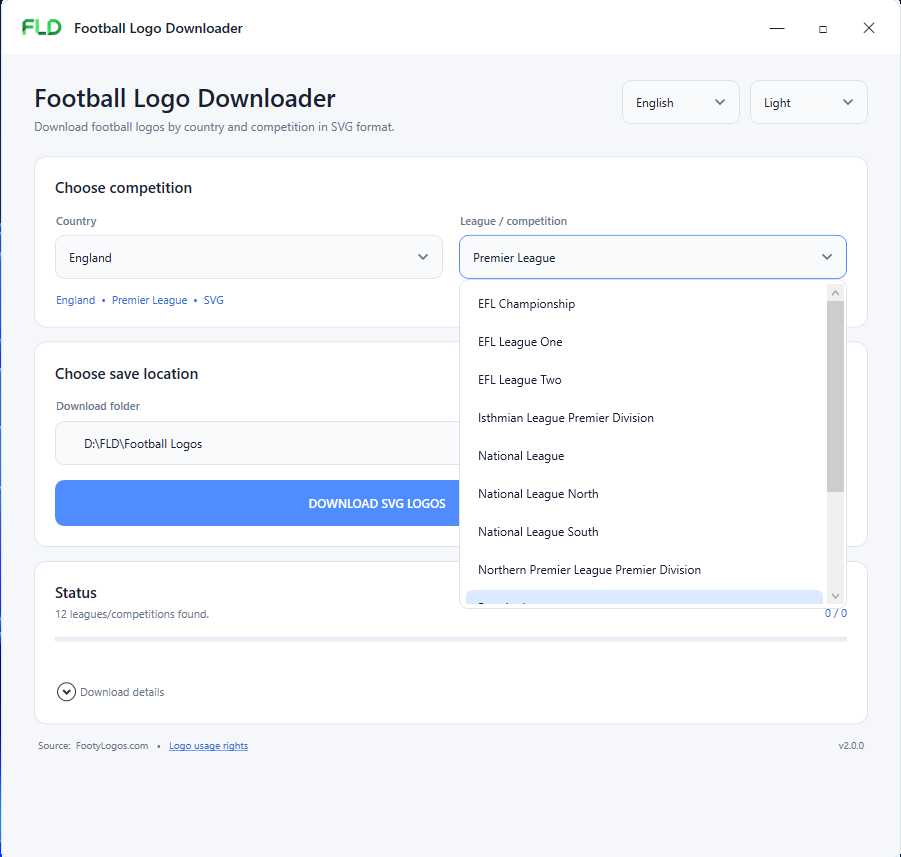
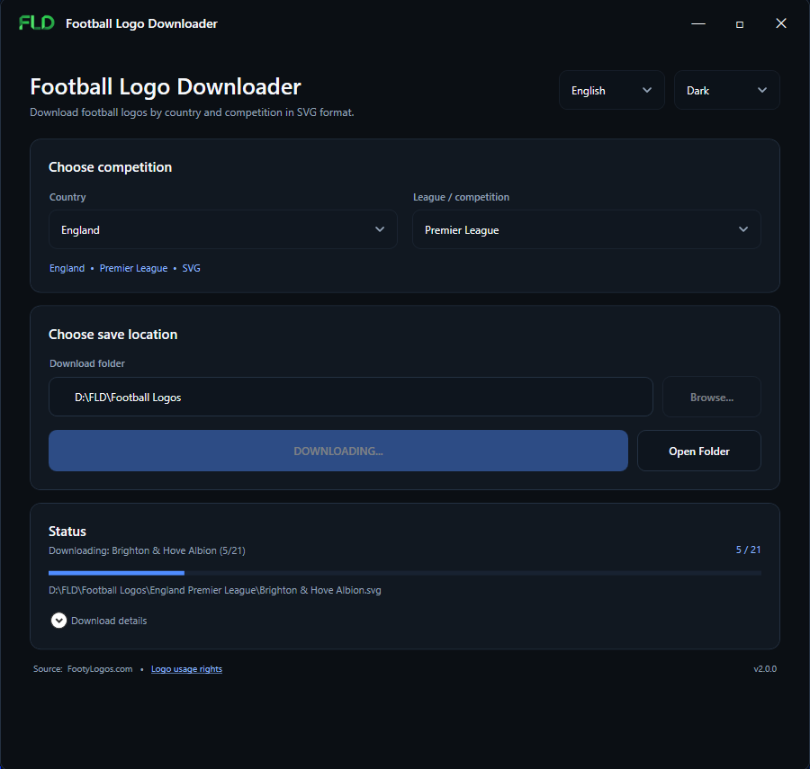
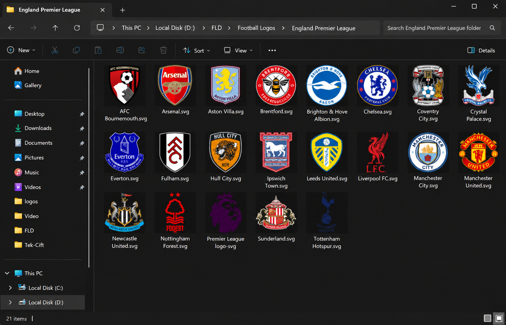

<div align="center">


# Football Logo Downloader

**Download available football club and competition logos in SVG format by country and league.**

[](https://github.com/ozkancantasarim/football-logo-downloader/releases/latest)


[](LICENSE)

A lightweight Windows desktop application built for designers who need football logos quickly without searching for and downloading them one by one.

**[Download the latest release](https://github.com/ozkancantasarim/football-logo-downloader/releases/latest)**

</div>

## Screenshots

<table>
  <tr>
    <td width="50%" align="center">
      
      <br>
      <b>Dark Theme</b>
    </td>
    <td width="50%" align="center">
      
      <br>
      <b>Light Theme</b>
    </td>
  </tr>
</table>

### Download Process



### Download Result



---

---

## Features

- Country → league / competition selection
- Downloads available logos in **SVG vector format**
- **Turkish and English** interface
- **Dark, light and system** appearance modes
- Full Unicode filename support (`Beşiktaş`, `Malmö FF`, `Lech Poznań`, `Žalgiris`, etc.)
- Clean country + competition folder naming
- Existing valid SVG files are skipped automatically
- Download progress, status and detailed results
- Open the completed download folder directly from the application
- Remembers language, theme, output folder and recent selections locally
- **No API key, account or sign-in required**
- No administrator privileges required
- Standalone Windows executable; no PowerShell/BAT/VBS is used by the released application

---

## Download & Installation

1. Open the **[Releases](https://github.com/ozkancantasarim/football-logo-downloader/releases/latest)** page.
2. Download either:
   - `Football Logo Downloader.exe` for the standalone application, or
   - `Football-Logo-Downloader-v2.0.0-win-x64.zip` for the packaged release.
3. If you downloaded the ZIP, extract it first.
4. Run `Football Logo Downloader.exe`.

No setup wizard, API key or separate .NET installation is required for the published self-contained build.

> **Windows SmartScreen:** Until Authenticode signing is enabled for official releases, Windows may display an “Unknown publisher” warning. Verify downloads using the published SHA-256 checksum and only download releases from this repository.

---

## How to Use

```text
Choose language / appearance
          ↓
Choose country
          ↓
Choose league / competition
          ↓
Choose download folder
          ↓
Download SVG Logos
          ↓
Open Folder
```

The application downloads only the competition selected by the user instead of downloading an entire logo database.

---

## Requirements

- Windows 10 or Windows 11 (64-bit)
- Internet connection

The official release is published as a self-contained `win-x64` executable.

---

## Security & Privacy

Football Logo Downloader is designed as a non-privileged desktop utility. It does not require administrator rights, does not open a local server, and does not require or store passwords, API keys or account credentials.

Downloaded SVG content is validated before it is saved. Network requests are restricted to HTTPS FootyLogos endpoints and use the normal Windows/.NET certificate validation stack.

The application contains no telemetry or analytics. User preferences are stored locally on the computer.

For details:

- [Security Policy](SECURITY.md)
- [Privacy Policy](PRIVACY.md)
- [Security Engineering Review](SECURITY_REVIEW.md)

Official release builds include a `SHA256SUMS.txt` file for integrity verification.

---

## Verify a Download

After downloading an official release, compare the SHA-256 value of the EXE with `SHA256SUMS.txt`.

PowerShell example:

```powershell
Get-FileHash -Algorithm SHA256 ".\Football Logo Downloader.exe"
```

The resulting hash should match the value published with the same release.

---

<details>
<summary><strong>Build from source</strong></summary>

<br>

The project is built with **C# / .NET 10 / WPF**.

Install the .NET 10 SDK on Windows, then run:

```text
build-local.cmd
```

A successful developer build produces:

```text
publish\Football Logo Downloader.exe
publish\LICENSE.txt
publish\THIRD_PARTY_NOTICE.txt
publish\SHA256SUMS.txt
release\Football-Logo-Downloader-v2.0.0-win-x64.zip
```

The released application itself does not launch PowerShell. `build-local.cmd` uses PowerShell only as a developer build helper for checksum generation and ZIP packaging.

The repository also includes GitHub Actions for Windows builds, CodeQL scanning, NuGet vulnerability auditing and Dependabot monitoring.

</details>

---

## Source & Third-Party Rights

Logo/data source: **[FootyLogos.com](https://www.footylogos.com/)**.

This project is **not affiliated with, endorsed by, sponsored by, or officially connected with FootyLogos**.

Football club, federation, league and competition names, logos, badges, crests and trademarks remain the property of their respective rights holders. The availability of a logo for download does **not** grant a license to use that logo or trademark.

See:

- [`THIRD_PARTY_NOTICE.txt`](THIRD_PARTY_NOTICE.txt)
- [FootyLogos — Logo Usage & Rights](https://www.footylogos.com/logo-usage-right)

---

## Version History

See [`CHANGELOG.md`](CHANGELOG.md).

---

## License

The Football Logo Downloader source code is licensed under the **MIT License**. See [`LICENSE`](LICENSE).

The MIT License applies to the application source code only. It does not grant rights to third-party football logos, names, badges, crests or trademarks downloaded through the application.

---

<div align="center">

Made for football designers.

**Football Logo Downloader v2.0.0**

</div>
