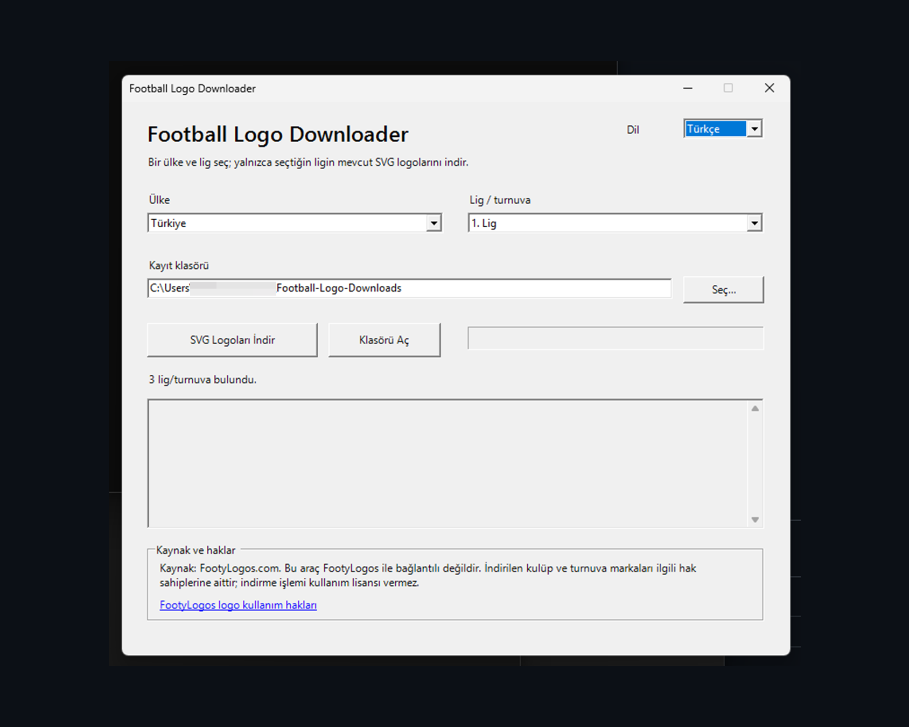
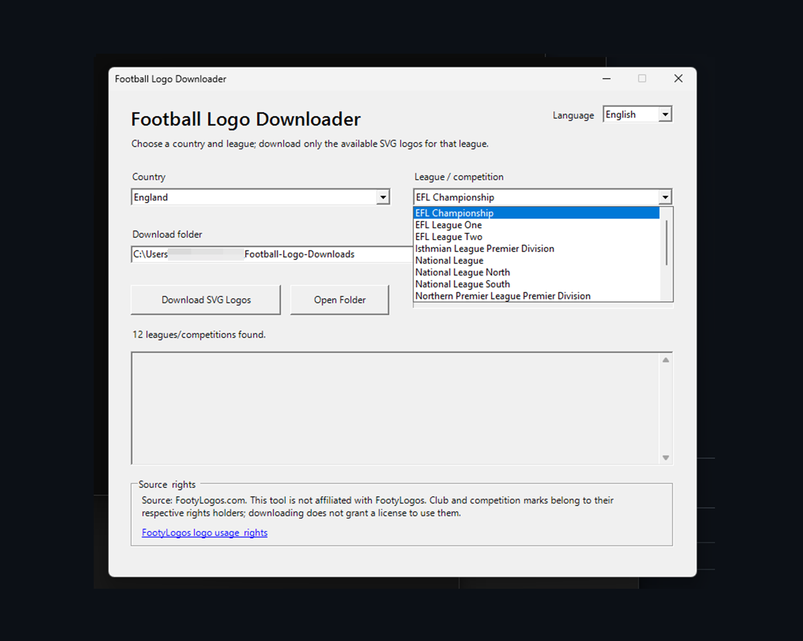
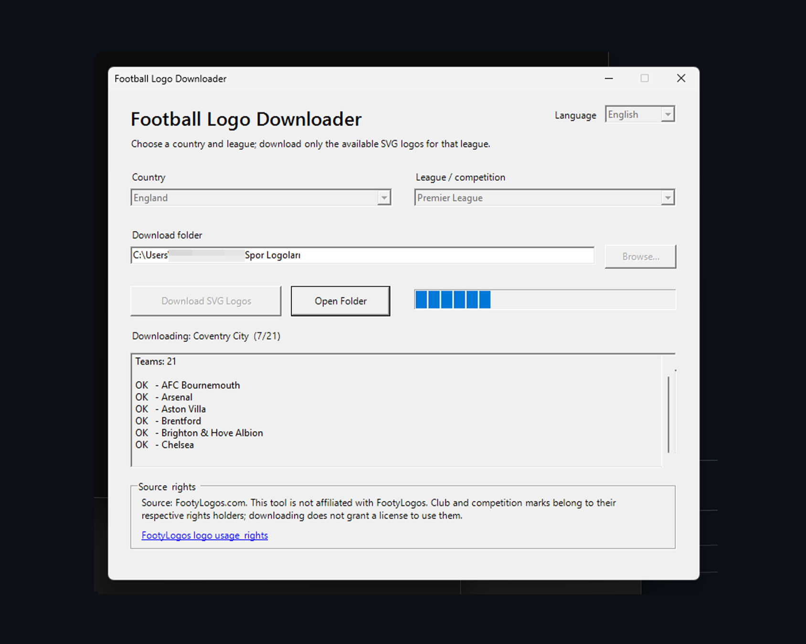
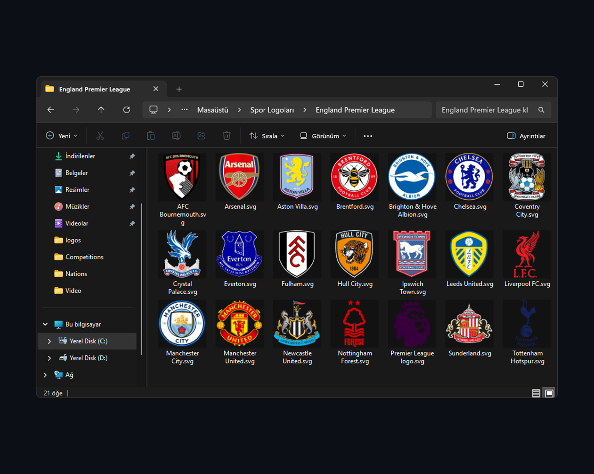

<div align="center">

# ⚽ Football Logo Downloader

**Download available football club logos in SVG format by country and league.**

[](https://github.com/ozkancantasarim/football-logo-downloader/releases/latest)


A lightweight Windows utility built for designers who need football club logos quickly, without searching and downloading them one by one.

**[Download Latest Release](https://github.com/ozkancantasarim/football-logo-downloader/releases/latest)**

## 📸 Screenshots

<table>
  <tr>
    <td width="50%" align="center">
      
      <br>
      <b>Turkish Interface</b>
    </td>
    <td width="50%" align="center">
      
      <br>
      <b>English Interface</b>
    </td>
  </tr>
</table>

### Download Process



### Download Result



</div>

---

## ✨ Features

- 🌍 **Country → league selection**
- ⚽ Downloads logos only for the **selected league**
- 🖼️ Downloads available logos in **SVG vector format**
- 🇹🇷 🇬🇧 **Turkish and English interface**
- 🔤 Full Unicode filename support  
  `Beşiktaş`, `Malmö FF`, `Lech Poznań`, `Žalgiris`, etc.
- 📁 Clean **country + league** folder naming
- ♻️ Existing valid SVG files are automatically skipped
- 🔑 **No API key required**
- ⏳ Visible loading state during initial data loading
- 🪟 Built for **Windows 10 / Windows 11**

---

## 📁 Folder Naming

Downloaded league folders are created with clear names such as:

```text
Türkiye Süper Lig
İspanya LA LIGA
Almanya Bundesliga 2
Litvanya A Lyga
İngiltere Premier League
```

Club logos are saved using their original club names whenever possible:

```text
Beşiktaş.svg
Fenerbahçe.svg
Galatasaray.svg
Malmö FF.svg
Lech Poznań.svg
Žalgiris.svg
```

---

## 🚀 Installation

1. Open the **[Releases](https://github.com/ozkancantasarim/football-logo-downloader/releases/latest)** page.
2. Download the latest ZIP package.
3. Extract the ZIP to a folder.
4. Run:

```text
Football Logo Downloader v1.0.2.bat
```

5. Wait a few seconds while the initial country data loads.
6. Choose your language, country and league.
7. Select a download folder.
8. Click **Download SVG Logos / SVG Logoları İndir**.

> No installation wizard or API key is required.

---

## 🖥️ How It Works

```text
Choose language
      ↓
Choose country
      ↓
Choose league / competition
      ↓
Choose download folder
      ↓
Download SVG Logos
```

The application downloads only the league selected by the user instead of downloading an entire logo database.

---

## ✅ Requirements

- Windows 10 or Windows 11
- Windows PowerShell 5.1+
- Internet connection

The interface is built with Windows Forms and is currently intended for Windows.

---

## 🛡️ Windows Security Notice

Football Logo Downloader is currently distributed as a **PowerShell script + BAT launcher** and is **not digitally signed**.

Because of this, Windows SmartScreen or antivirus software may occasionally display a warning.

The source files are included in the repository so they can be inspected before running.

---

## 🔄 Updating

When a newer version is released:

1. Visit **[Latest Release](https://github.com/ozkancantasarim/football-logo-downloader/releases/latest)**.
2. Download the newest ZIP.
3. Extract it to a new folder.
4. Run the new version.

---

## 🌐 Source & Third-Party Rights

Logo/data source used by the downloader:

**[FootyLogos.com](https://www.footylogos.com/)**

This project is **not affiliated with, endorsed by, sponsored by, or officially connected with FootyLogos**.

Football club, federation, league and competition names, logos, badges, crests and trademarks remain the property of their respective rights holders.

The availability of a logo for download **does not grant a license to use that logo commercially or for any other purpose**.

For more information:

**[FootyLogos — Logo Usage & Rights](https://www.footylogos.com/logo-usage-right)**

See also: [`THIRD_PARTY_NOTICE.txt`](THIRD_PARTY_NOTICE.txt)

---

## 📦 Releases

### v1.0.2 — Initial Public Release

- Country and league selection
- SVG logo downloading
- Turkish / English UI
- Unicode filename support
- Country + league folder naming
- Existing-file detection
- Startup loading indicator
- No API key required

**[View all releases →](https://github.com/ozkancantasarim/football-logo-downloader/releases)**

---

<details>
<summary><strong>🇹🇷 Türkçe</strong></summary>

<br>

## Football Logo Downloader nedir?

Football Logo Downloader, grafik tasarımcıların futbol kulübü logolarını tek tek aramak yerine **ülke ve lig seçerek SVG formatında indirebilmesi** için hazırlanmış Windows aracıdır.

### Özellikler

- Ülke → lig seçimi
- Yalnızca seçilen ligin logolarını indirir
- SVG vektör formatı
- Türkçe / İngilizce arayüz
- Türkçe ve özel karakter desteği
- API anahtarı gerektirmez
- Daha önce indirilmiş geçerli SVG dosyalarını tekrar indirmez

### Kullanım

1. **[Releases](https://github.com/ozkancantasarim/football-logo-downloader/releases/latest)** sayfasından son sürümü indirin.
2. ZIP dosyasını klasöre çıkarın.
3. `Football Logo Downloader v1.0.2.bat` dosyasını çalıştırın.
4. Ülke ve ligi seçin.
5. Kayıt klasörünü belirleyin.
6. **SVG Logoları İndir** butonuna basın.

### Haklar

Logo/veri kaynağı **FootyLogos.com**'dur.

Bu proje FootyLogos ile bağlantılı değildir ve FootyLogos tarafından desteklenmemekte veya onaylanmamaktadır.

Kulüp, lig, federasyon ve turnuva logoları ilgili hak sahiplerine aittir. Bir logonun indirilebilir olması, kullanım lisansı verildiği anlamına gelmez.

</details>

---

<div align="center">

Made for football designers.

**Football Logo Downloader v1.0.2**

</div>
